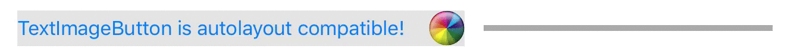
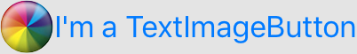
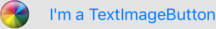
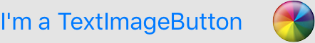

# TextImageButton

[](https://travis-ci.org/timbodeit/TextImageButton)
[](http://cocoapods.org/pods/TextImageButton)
[](http://cocoapods.org/pods/TextImageButton)
[](http://cocoapods.org/pods/TextImageButton)

Image spacing and side selection for UIButton. Fully auto-layout compatible.



## Usage

Setting text and image on TextImageButton works like it does on a vanilla UIButton:

```swift
let button = TextImageButton()

button.setTitle("I'm a TextImageButton", forState: .Normal)
button.setImage(UIImage(named: "beachball"), forState: .Normal)
```



---

#### Spacing

It allows specifying the spacing between title and image:

```swift
button.spacing = 20
```



---

#### Image position

To choose the side the image is set on, specify `imagePosition`.  
There is also boolean @IBInspectable `imageOnRight` attribute that you can set inside the storyboard

```swift
button.imagePosition = .Right
```



## Swift Version

While TextImageButton can be used in Objective-C code, it is written completely in Swift.

Version 0.2 is compatible with Swift 3.
For Swift 2 use Version 0.1.1.

## Example Project

To run the example project, clone the repo, and run `pod install` from the Example directory first.

## Installation

TextImageButton is available through [CocoaPods](http://cocoapods.org). To install
it, simply add the following line to your Podfile:

```ruby
pod "TextImageButton"
```

## Author

Tim Bodeit, tim@bodeit.com

Inspired by [this](http://stackoverflow.com/a/7113702/1984384) stackoverflow answer by [jasongregori](http://stackoverflow.com/users/184561/jasongregori).

## License

TextImageButton is available under the MIT license. See the LICENSE file for more info.
